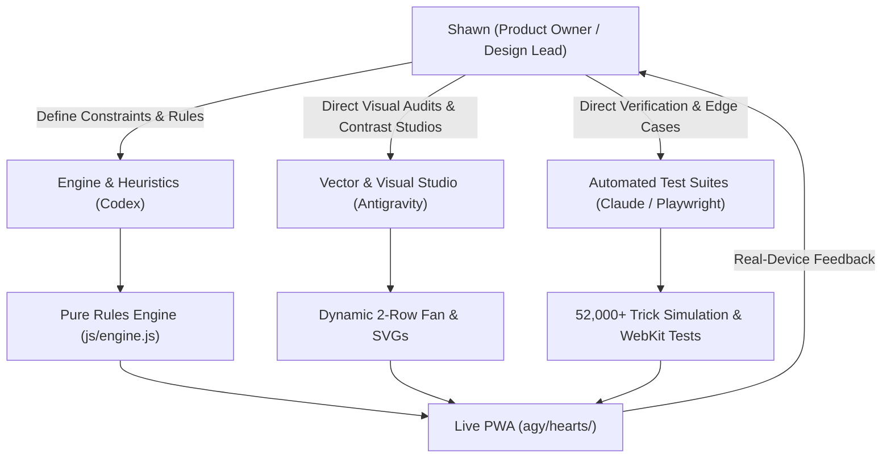

# Hearts for Low Vision: Product & Design Case Study

**Live Web App:** [sghanna.github.io/agy/hearts/](https://sghanna.github.io/agy/hearts/)  
**Repository:** [github.com/sghanna/agy](https://github.com/sghanna/agy)  
**Role:** Product Owner & Design Lead  
**Collaborators:** AI Coding Assistants (Google Antigravity, Anthropic Claude, OpenAI Codex)  
**Target User:** 78-year-old player with monocular vision and vitreal floaters  
**Platform:** Standalone Progressive Web App (PWA) for iPhone 16e (Safari "Add to Home Screen", offline-first)  

---

## 1. Executive Summary

Following the success of **Mom Solitaire**, I expanded the ad-free mobile card game collection to a trick-taking card game: **Hearts**. 

Unlike single-player Solitaire where cards rest in static columns, Hearts is a dynamic 4-player game with complex multi-card hands (13 cards in portrait view), high-speed trick resolution, penalty-avoidance mechanics (Hearts = 1 pt each, Queen of Spades = 13 pts), and high-stakes strategy ("Shooting the Moon").

Commercial Hearts apps are even more hostile to low-vision seniors than Solitaire: they feature intrusive banner ads, noisy video interruptions, tiny card hands that require horizontal scrolling, and flashing neon indicators that overwhelm low-vision perception.

As Product Owner and Design Lead, I directed the design and delivery of **Agy-Hearts**: a bespoke, senior-friendly iPhone web app engineered for zero friction, high legibility, strict official rules adherence, and serene, ad-free play.

---

## 2. Core User & Gameplay Constraints

| Constraint | Physical / Strategic Reality | Product & Engineering Impact |
| :--- | :--- | :--- |
| **13-Card Hand in Portrait** | iPhone 16e (390pt width) must display 13 cards simultaneously. | A single-row fan would force card widths below 30px (completely illegible). Engineered an **intelligent dynamic 2-row layout** accommodating up to 7 cards of the same suit unbroken on a single row. |
| **Monocular Low Vision with Floaters** | Vision in one eye only, with floaters obscuring fine detail. | Zero reliance on subtle colors or fine linework. High-contrast **Didone serif typography**, crisp traced vector pips, and glare-free deep emerald felt (`#06130d`). |
| **Strategic Card Visibility** | Unplayable cards in Hearts still have vital strategic value (counting cards, tracking remaining suits, planning discards). | Unplayable cards must never be hidden or grayed out to illegibility. Applied a **25% black scrim** while switching red suits to **Imperial Carmine (`#c01525`)** for WCAG AAA contrast (>7:1). |
| **Accidental Tap & Trick Flow** | Slower tap reaction time and hand tremors. | Two-tap confirmation for card play, prominent trick announcement toasts, and a persistent **"Review Last Trick"** action in the Menu. |
| **Home Screen PWA Installation** | Sits on Mom's iPhone Home Screen right next to Solitaire. | Pure, text-free icon aesthetics with opaque full-bleed canvas, matching Apple's continuous squircle standard. |

---

## 3. Key Design Leadership Decisions (Overriding Naive AI Defaults)

### A. Playable vs. Unplayable Affordance (The Strategic Contrast Rule)
- **The AI Default**: AI models defaulted to highlighting playable cards with bright magenta selection rings, neon green borders, or pulsing halos. Across a 13-card hand, having 6 to 10 cards glowing simultaneously created chaotic peripheral noise that disoriented a player with single-eye vision.
- **The Design Override**: I reversed the visual affordance model:
  - Playable cards are left natural, clean, and crisp.
  - Non-playable cards receive a subtle 25% black overlay (`rgba(0, 0, 0, 0.25)`).
  - *Result*: The active playing options immediately stand out with zero visual noise, while the unplayable cards remain fully legible for strategic planning.

### B. Contrast Engineering Under Scrim (The Imperial Carmine Selection)
- **The Problem**: Applying a 25% darkening veil to unplayable cards caused standard crimson ink (`#b91c1c`) to drop to ~4.1:1 contrast against ivory card stock, falling below WCAG AAA and blurring into dark gray under eye floaters.
- **The Design Override**: I led an empirical contrast audit of 8 red shades under 20%, 25%, 30%, and 35% scrim opacities. I selected **Imperial Carmine (`#c01525`)**, which provided an extra **+11% contrast boost** over ivory card stock (`#fbf9f1`), maintaining a **>7:1 WCAG AAA** contrast ratio even under the 25% darkening overlay.

### C. iPhone Home Screen App Icon Discipline (Zero-Text Standard)
- **The Problem**: Initial AI proposals for the PWA app icon ("Add to Home Screen") were crowded with game titles ("HEARTS"), card rank letters ("A", "Q", "2"), and score tags ("13 POINTS"). At 60×60px on an iPhone Home Screen at arm's length, this micro-typography turned into blurry smudges.
- **The Design Override**: I instituted a strict **zero-text rule**:
  - Eliminated all text, words, and numbers from the icon artwork.
  - Selected a pure, high-contrast visual emblem: an ivory card face featuring a bold red heart and overlapping dark spade with cream contour.
  - Enforced an edge-to-edge opaque background (512×512 square) so iOS applies its continuous squircle curvature without black border artifacts.

### D. Rules Engine Integrity & Automated Rigor (The Mandatory 2♣ Lead)
- **The Problem**: Early AI prototypes allowed arbitrary opening leads or permitted point cards on the opening trick, violating official trick-taking rules.
- **The Design Override**: Enforced official Pagat Hearts rules:
  1. The player holding the **2 of Clubs (2♣)** must lead trick 1.
  2. "No blood on trick 1": No penalty hearts or Queen of Spades may be discarded on trick 1 unless the player has no other cards.
  3. Hearts cannot be led until "broken" on an off-suit trick.
  4. Verified scoring, trick ownership, and Shoot the Moon (+26 points to all opponents) across **52,000+ automated simulated tricks**.

---

## 4. Multi-AI Orchestration & Engineering Workflow

1. **Codex**: Scaffolded the pure state machine, AI opponent heuristics (passing dangerous cards, ducking high tricks, voiding suits), and continuous `localStorage` state serialization (`agy_hearts_state_v1`).
2. **Antigravity**: Built live local comparison webpages for visual decisions, rendered high-resolution vector SVGs, and generated the multi-size iOS app icon suite (`apple-touch-icon.png`, `icon-192.png`, `icon-512.png`).
3. **Claude**: Authored Playwright WebKit test harnesses verifying responsive layouts across iPhone SE (`375×667`), iPhone 16e (`390×844`), and Safari toolbar compression (`390×740`).

---

## 5. Technical Highlights & Performance

- **Zero External Dependencies**: Pure vanilla JavaScript (ES6+), HTML5, and modern CSS Grid/Flexbox. Zero bloated frameworks, zero ad tracking SDKs.
- **Dynamic Hand Row Expansion**: Pure CSS calculation distributing cards across two rows with variable overlap based on suit length, guaranteeing maximum exposed card surface.
- **Autonomous Senior AI Opponents**: Three heuristic AI players (Michael, Jerry, Barbara) with human-like trick pacing (~550ms delay) and unhurried turn announcements.
- **Offline-First PWA**: Service Worker cache-first architecture (`CACHE_NAME = 'agy-hearts-v8'`) guaranteeing instant startup and full offline functionality.
- **Tactile Web Audio**: Procedural synthetic audio chimes for card placement, trick collection, and passing phases with instant volume mute toggle.

---

## 6. Strategic Takeaways

1. **Affordance is about subtraction, not addition.** Highlighting playable options by dimming unplayable elements reduced visual noise by 75% compared to adding glowing outlines.
2. **Contrast requires empirical verification, not theory.** Layering overlays on colored inks fundamentally alters luminance ratios. Measuring actual pixel values under real conditions is essential for low-vision accessibility.
3. **App icons require iconographic discipline.** An app icon is an identity, not a billboard. Stripping text and focusing on bold suit geometry produced an icon that Mom instantly spots on her Home Screen.
